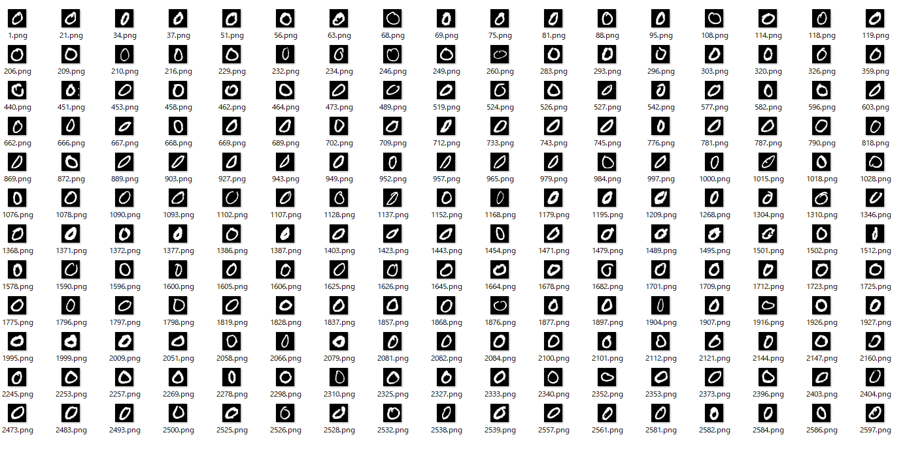
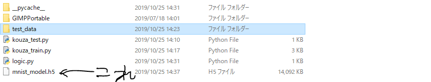
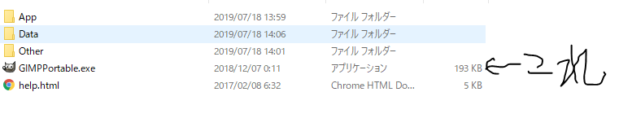
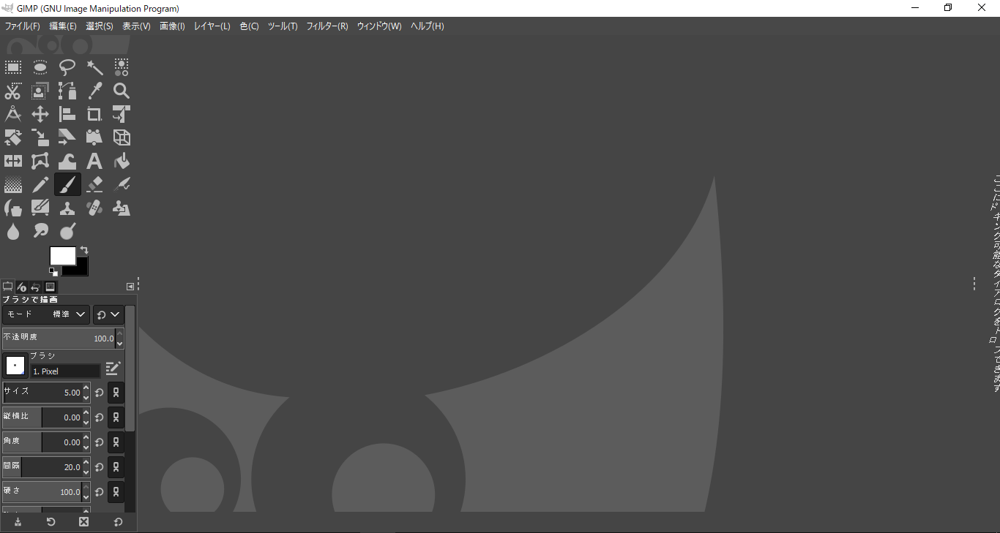
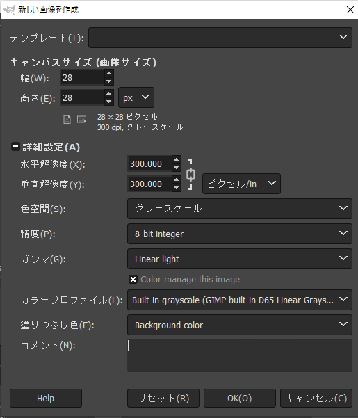
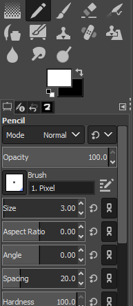
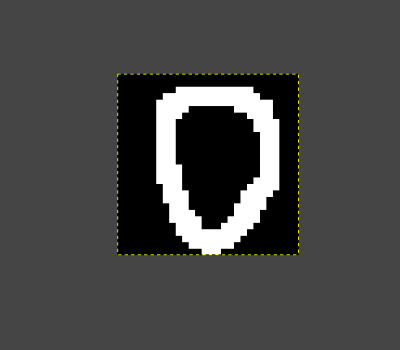
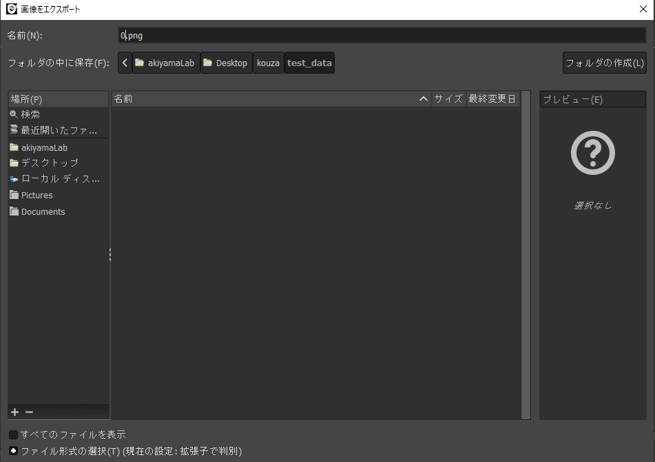

# 実際にやってみよう

## 学習
今回の講座は、0から1の数字を識別する教師あり学習の画像分類です。  
教師あり学習とは、正解の情報付きのデータを学習することです。  
0から9までの画像に正解の情報をつけて学習します。  
学習に用いるデータはmnistという0から9の画像の集まりです。  
数は学習用の60000個と、検証用の10000個です。  
<br>

<br>
<br>
この画像は一つ一つ28x28のグレースケールに加工されたものになっています。  
mnistの画像は28x28なので、入力を784個にします。  
出力は0から9の10種類なので、出力は10個です。  
では学習しましょう。  

```
C:\User\Desktop\kouza10-26>python kouza_train.py
epoch 1/1
128/60000 [====>................] - ETA: 87s
loss: 0.08
accuracy: 0.95
```
ここのepochは学習が何回目かを示し、lossは目標との差を示します。  
accuracyとは正解率のことで、  
60000個からできたニューラルネットワークに10000個の検証データを  
判定させたものです。
<br>
<br>

<br>
<br>
フォルダ内にmnist_model.h5というファイルができたと思います。  
これが学習でできた重みやバイアスが入っているファイルです。  
<br>
なお、mnistの70000個のデータはどこにあるかというと、  
ローカルディスクのuser/.keras/datasetにあります。  
<br>

## 判定
次は実際に自分で手書き数字を描いて判定してみましょう。  
フォルダ内のGimPPortableを開いてGIMPPortable.exeを起動しましょう。  
<br>

<br>
<br>

<br>
<br>
ファイルの新しい画像の生成をクリックしてください。  
<br>

<br>
<br>
幅と高さをmnistのデータに合わせて変更します。  
詳細設定をクリックして色空間をグレースケールに、  
コメントは消しましょう。  
<br>

<br>
<br>
ペンを選んでsizeを4.0にします。  
書いてみましょう。  
<br>

<br>
描いたらCtrl + Shift + E を押してください。  
<br>

<br>
<br>
フォルダ内のtest_dataを選択し、ファイル名を描いた数字.pngにして  
エクスポートします。  
これを0から9まで書きましょう。  
完了したら、コマンドでkouza_test.pyを実行しましょう。  
```
C:\User\Desktop\kouza10-26>python kouza_test.py
image is 0.png | result is 1 | OK
image is 0.png | result is 1 | OK
image is 0.png | result is 1 | OK
..............
image is 0.png | result is 1 | OK
------------------
OK = 8 | NG = 2 | accuarcy = 80.0%
```
判定が出たと思います。  
そこそこ高い正解率を得られたと思います。  
これでこの章は終わります。  
実際に数字の判別をすることができました。  
[参考にしたサイト](https://qiita.com/moritalous/items/1c014afbb97a2e48bbdf)

<br>
[前へ](../03third/page.md)・[次へ](../05fin/page.md)
<br>
<br>
[HOME](../index.md)
