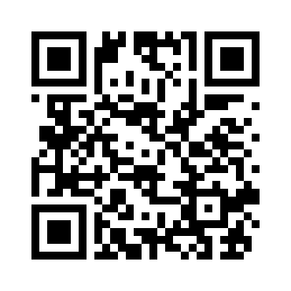

# 終わりに

## 今回の講座で学んだこと
今回はAIの仕組みを知ることができました。  
- AIの仕組みを知った
 
パーセプトロン、ニューラルネットワーク
- プログラミングを書いた
 
AIに応用可能なpythonを使ったプログラムを書いた
- 実際に動かした
 
0から9の数字の判別ができた

この体験が少しでも今後の勉強の助けになれば幸いです。  

## 事後アンケート
本日は講座にご参加いただきありがとうございました。  
最後に事後アンケートにご協力おねがいします。  
[アンケートはこちら](https://forms.gle/U593nFjjSk4zqwH4A)
 
 

 
↑QRコードです  
 
[前へ](../04fourth/page.md)
 
 
[HOME](../index.md)
